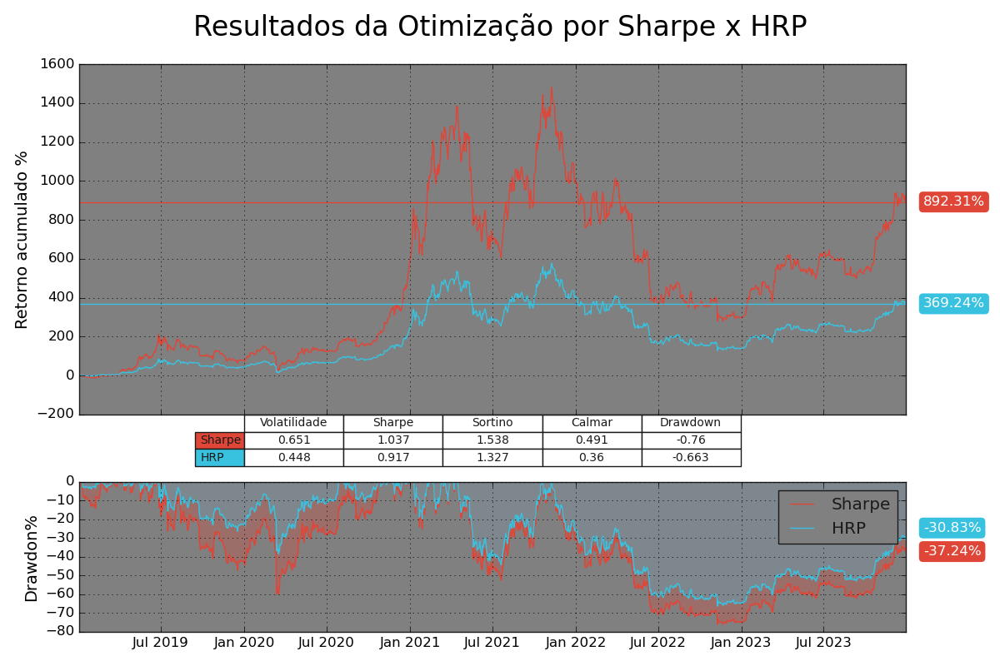

# Estudo comparativo entre a otimização pelo método da Teoria Moderna de Portfólios de Markowitz e Hierarchical Risk Parity (HRP) com ETFs dos EUA, Bitcoin e Ouro

## Introdução à Teoria Moderna de Portfólios (MPT) e Hierarchical Risk Parity (HRP)

### Método de Markowitz

Em 1952, Harry Markowitz introduziu a ideia da diversificação baseada no risco, revolucionando a gestão de investimentos ao demonstrar que os investidores podem construir carteiras que maximizam os retornos esperados para um nível de risco dado ou minimizam o risco para um retorno esperado desejado, criando a **Fronteira Eficiente** de alocação utilizando o método de média-variância.

Markowitz mostrou que o retorno esperado de uma carteira não depende apenas da média dos retornos individuais dos ativos, mas também da correlação entre eles. No entanto, a MPT, apesar de excelente na teoria, apresenta limitações na prática, como a necessidade de estimativas dinâmicas de retorno e correlação dos ativos ao longo do tempo.

### Hierarchical Risk Parity (HRP)

O método de Hierarchical Risk Parity (HRP) é uma abordagem moderna para a construção de portfólios introduzida por Marcos López de Prado. Ao contrário da otimização de média-variância, que assume independência entre os ativos, o HRP considera as relações de dependência entre eles. Utilizando técnicas de agrupamento hierárquico, o HRP estrutura o portfólio de forma a minimizar o risco global, distribuindo o peso dos ativos de maneira proporcional à sua contribuição para o risco total do portfólio. Isso permite uma melhor gestão de riscos em cenários de mercado complexos e dinâmicos.

1. **Agrupamento Hierárquico:** Os ativos são agrupados em clusters com base em suas características de risco e retorno, utilizando técnicas de aprendizado de máquina ou análise de cluster.

2. **Alocação por Nível:** Os ativos são alocados para cada nível da hierarquia de acordo com um objetivo de risco pré-definido.

3. **Otimização Dentro de Clusters:** A alocação de ativos dentro de cada cluster pode ser otimizada utilizando técnicas tradicionais, como o próprio modelo de Markowitz.

# Resultado Final

